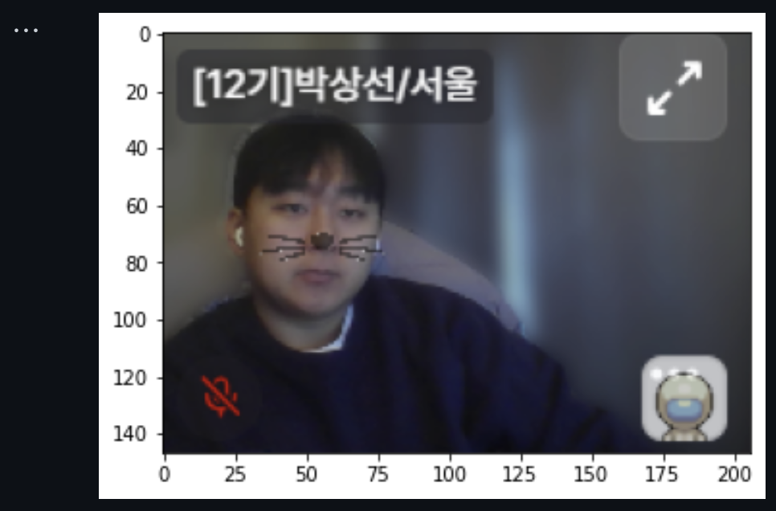
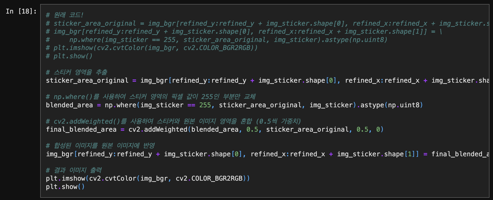
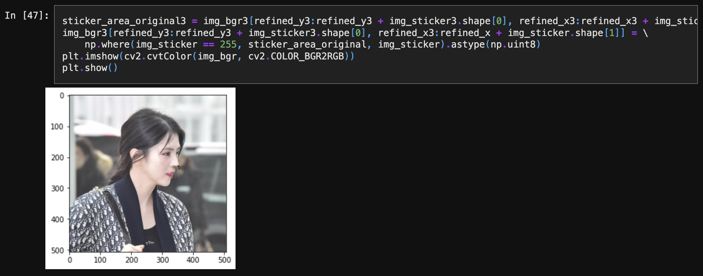
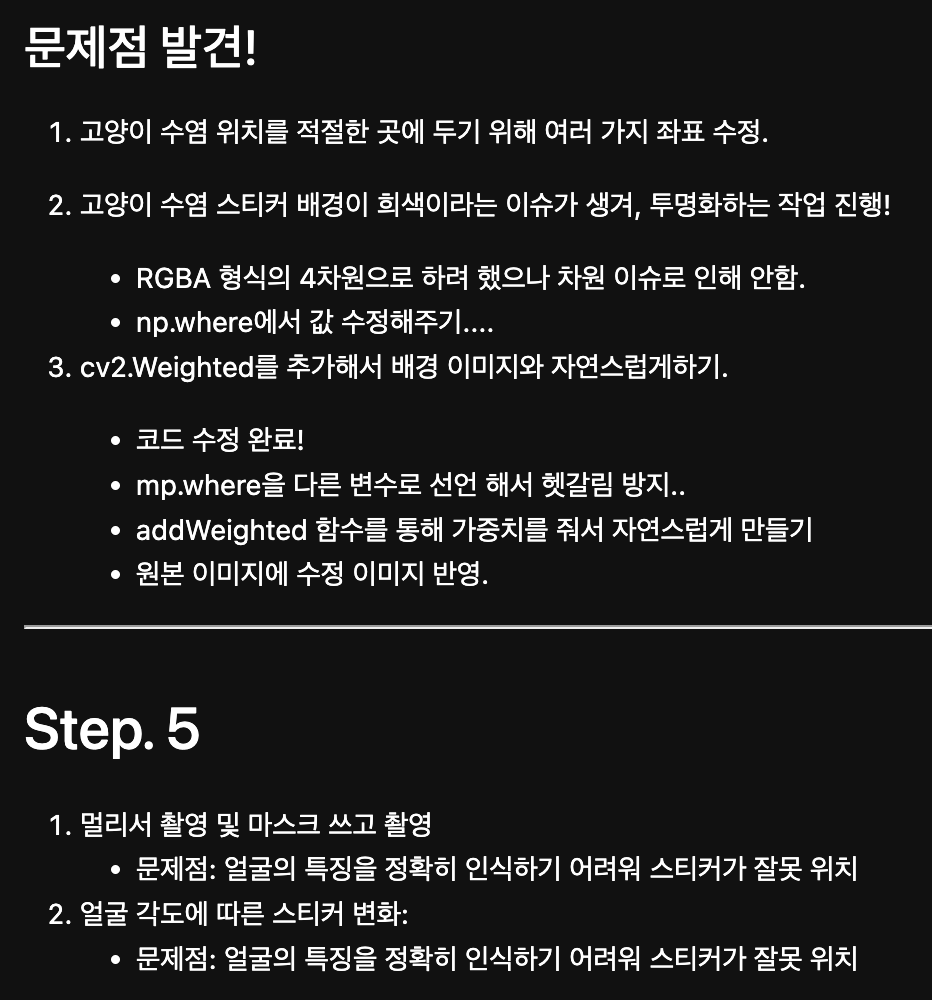
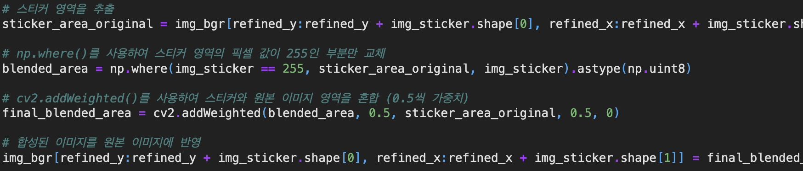

# AIFFEL Campus Online Code Peer Review Templete
- 코더 : 박상선
- 리뷰어 : 홍예린


# PRT(Peer Review Template)
- [x]  **1. 주어진 문제를 해결하는 완성된 코드가 제출되었나요?**
    - 고양이 수염을 붙이는 문제를 완벽히 해결함
      
    
- [x]  **2. 전체 코드에서 가장 핵심적이거나 가장 복잡하고 이해하기 어려운 부분에 작성된 
주석 또는 doc string을 보고 해당 코드가 잘 이해되었나요?**
    - 추가적으로 배경과 자연스러운 반투명한 수염을 만드는 실험을 진행
      
      - 자칫 복잡할 수 있는 코드에 주석을 한 줄씩 남겨 이해하기 편리
        
- [x]  **3. 에러가 난 부분을 디버깅하여 문제를 해결한 기록을 남겼거나
새로운 시도 또는 추가 실험을 수행해봤나요?**
    - 추가적으로 옆 모습도 인식이 잘 되는지 확인
      
      - 스티커를 붙였을 때 부자연스러움
      - 얼굴 바운딩 박스는 잘 되었으나, 스티커를 붙이기 위해 랜드마크를 예측했을 때 제대로 인식이 되지 않음을 확인
        
- [x]  **4. 회고를 잘 작성했나요?**
    - 실험을 하며 문제가 있었던 부분이나 추가적인 실험을 통해 얻은 인사이트를 기록
      
        
- [x]  **5. 코드가 간결하고 효율적인가요?**
    - 이해하기 쉬운 네이밍을 사용하여 이해를 도움
      
    - 함수화를 했으면 더 간결해질 수 있었을 듯!

# 회고(참고 링크 및 코드 개선)
```
- 주석을 적절하게 남겨두어 이해가 쉬웠음!
  - 주석의 중요성을 다시 한 번 느낌
- 옆 모습은 실험할 생각을 못 했는데 좋은 인사이트를 얻을 수 있었음!
- 불투명하게 만드는 실험도 인상적!
```

