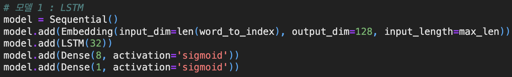
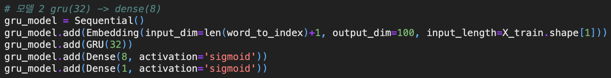
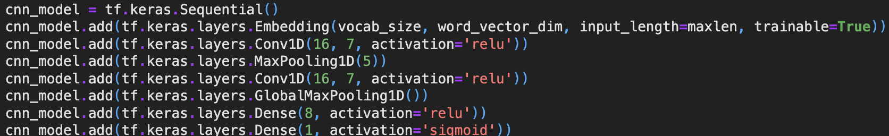
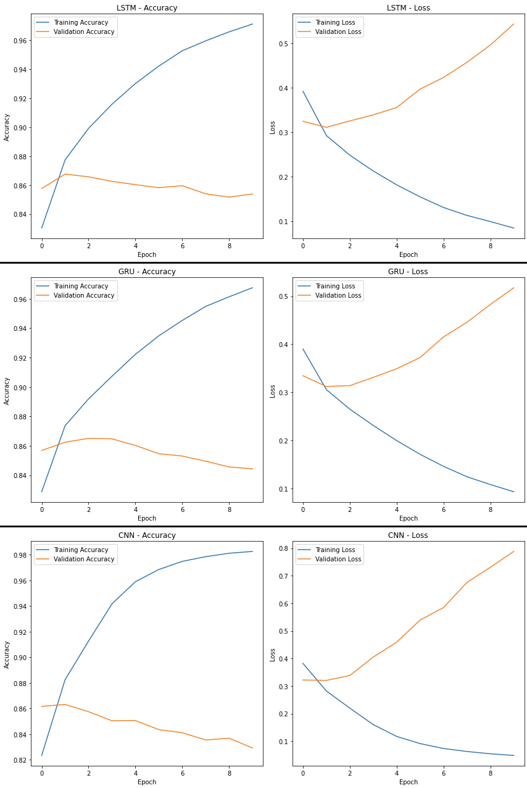
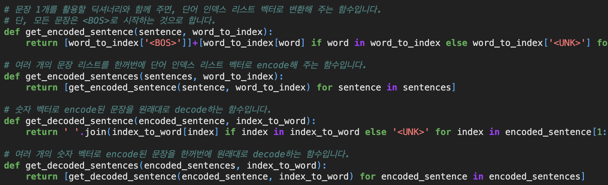
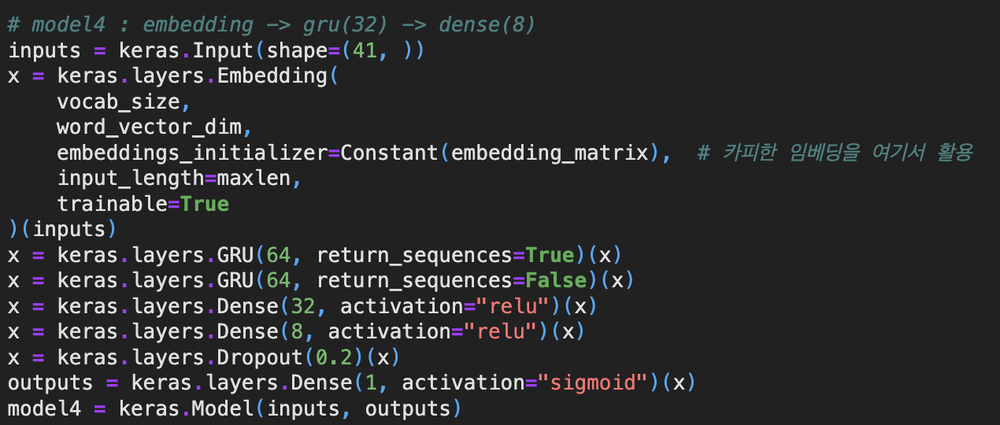
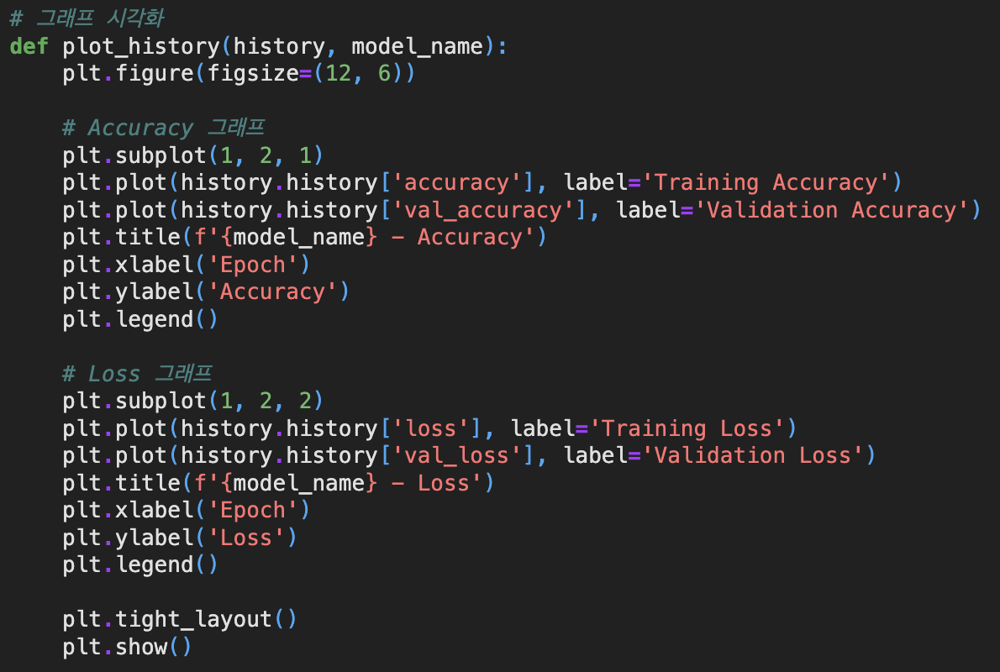

# AIFFEL Campus Online Code Peer Review Templete
- 코더 : 박상선
- 리뷰어 : 홍예린


# PRT(Peer Review Template)
- [X]  **1. 주어진 문제를 해결하는 완성된 코드가 제출되었나요?**
    세 가지 모델이 구현되고 성능 비교도 되었음.
    - LSTM model
    
    - GRU model
    
    - CNN model
    
    - 세 가지 모델 성능 비교
    
    
- [X]  **2. 전체 코드에서 가장 핵심적이거나 가장 복잡하고 이해하기 어려운 부분에 작성된 
주석 또는 doc string을 보고 해당 코드가 잘 이해되었나요?**
    - 주석을 남겨 인코딩 디코딩 부분이 잘 이해가 됨
    
        
- [X]  **3. 에러가 난 부분을 디버깅하여 문제를 해결한 기록을 남겼거나
새로운 시도 또는 추가 실험을 수행해봤나요?**
    - 전이 학습을 추가적으로 실험함
      
        
- [X]  **5. 코드가 간결하고 효율적인가요?**
    - 그래프 시각화하는 부분에서 함수화를 하여 코드 중복을 줄임
      


# 회고(참고 링크 및 코드 개선)
```
- LSTM, GRU, CNN 세 가지 모델을 사용하여 성능 평가를 한 후에 미리 학습된 임베딩 벡터를 활용하여 더욱 성능을 향상시킴
- 군더더기 없는 깔끔한 코드
- 성능을 시각화하여 모델끼리 비교하기가 쉬웠음
```

