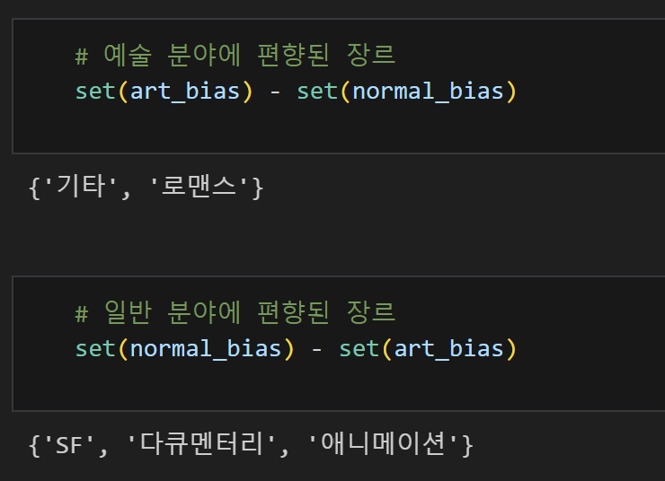
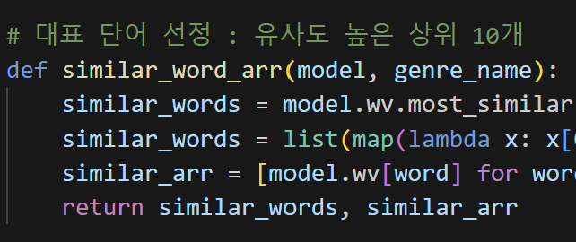
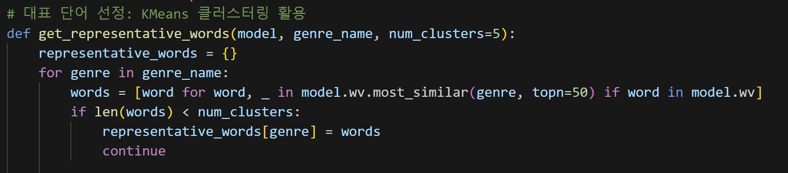
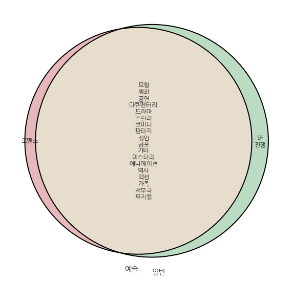
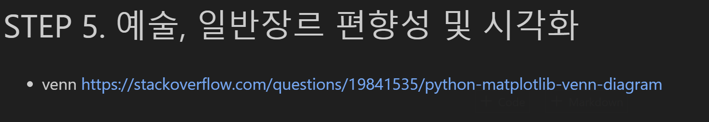

# AIFFEL Campus Online Code Peer Review Templete
- 코더 : 박상선
- 리뷰어 : 손병진

# PRT(Peer Review Template)
- [x]  **1. 주어진 문제를 해결하는 완성된 코드가 제출되었나요?**
    - 주어진 조건에 맞게 단어셋을 구성하고 편향을 확인하였음.
        - 
    
- [x]  **2. 전체 코드에서 가장 핵심적이거나 가장 복잡하고 이해하기 어려운 부분에 작성된 주석 또는 doc string을 보고 해당 코드가 잘 이해되었나요?**
    - 각 코드마다 어떠한 코드인지 주석처리를 통해 가독성이 좋음.
        - 
    
        
- [x]  **3. 에러가 난 부분을 디버깅하여 문제를 해결한 기록을 남겼거나 새로운 시도 또는 추가 실험을 수행해봤나요?**
    - 의문점이 드는 부분에서 K-means 등 다양한 방법을 통해 실험을 추가 진행하고 결과를 정리함.
        - 
        
- [x]  **4. 회고를 잘 작성했나요?**
    - 실험 결과와 느낌점을 회고로 작성함.
        - 
        
- [x]  **5. 코드가 간결하고 효율적인가요?**
    - 벤다이어그램 방식의 시각화를 통해 실험 결과를 알기쉽게 보여줌.
        - 
    - 해당 시각화 툴에 대한 링크를 첨부하여 이해를 도움.
        - 

# 회고(참고 링크 및 코드 개선)
- 벤다이어그램을 통한 시각화가 가독성이 좋아서 새로운 시각화기법에 대해서 배웠습니다.
- k-means 클러스터링 통한 유사한 단어로 군집화하는 아이디어가 새롭고 기발했습니다.

