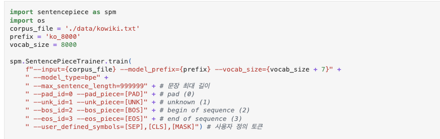
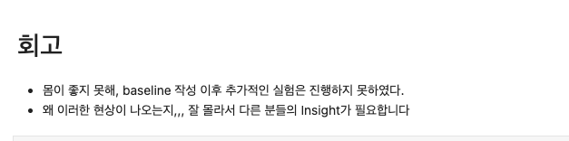
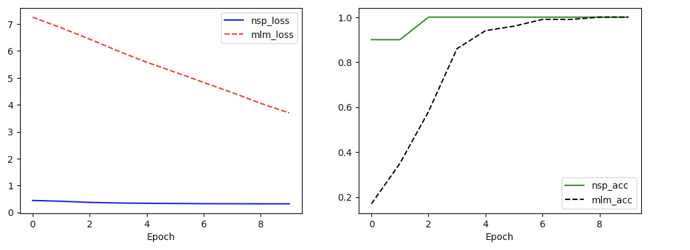

# AIFFEL Campus Online Code Peer Review Templete
- 코더 : 박 상선
- 리뷰어 : 김 영만


# PRT(Peer Review Template)
- [*]  **1. 주어진 문제를 해결하는 완성된 코드가 제출되었나요?**
    - 한글 코퍼스를 가공하여 BERT pretrain용 데이터셋 생성을 완료 하였습니다.
        
    
- [*]  **2. 전체 코드에서 가장 핵심적이거나 가장 복잡하고 이해하기 어려운 부분에 작성된 
주석 또는 doc string을 보고 해당 코드가 잘 이해되었나요?**
    - 8000개를 기준으로 token model, vocab 구성하는 부분이 설명이 잘 되어 있습니다.
          

- [ ]  **3. 에러가 난 부분을 디버깅하여 문제를 해결한 기록을 남겼거나
새로운 시도 또는 추가 실험을 수행해봤나요?**
    - 문제 원인 및 해결 과정을 잘 기록하였는지 확인
    - 프로젝트 평가 기준에 더해 추가적으로 수행한 나만의 시도, 
    실험이 기록되어 있는지 확인
        - 중요! 잘 작성되었다고 생각되는 부분을 캡쳐해 근거로 첨부
        
- [*]  **4. 회고를 잘 작성했나요?**
    - 아쉬운 점이 잘 기술 되어있습니다.
          
        
- [*]  **5. 코드가 간결하고 효율적인가요?**
    - 마스킹 하는 부분에 대해 함수화가 잘 되어있습니다.
          


# 회고(참고 링크 및 코드 개선)
```
pretrained model에 대한 전체 프로세스가 잘 구현 되어 있습니다.
수고 많이 하셨습니다.
```

